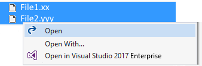
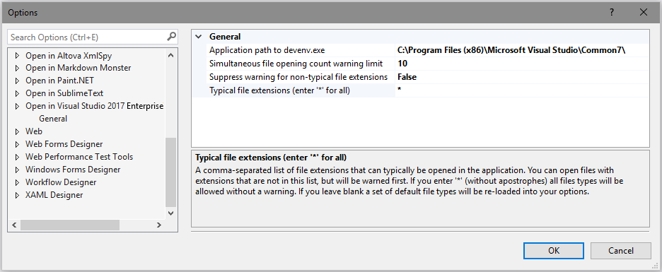

[AppVeyorProjectUrl]: https://ci.appveyor.com/project/GregTrevellick/openinvs2017enterprise
[AppVeyorProjectBuildStatusBadgeSvg]: https://ci.appveyor.com/api/projects/status/eiqlftg1g0a7jcxp?svg=true
[GitHubPagesURL]: https://gregtrevellick.github.io/OpenInVS2017Enterprise/
[GitHubRepoURL]: https://github.com/GregTrevellick/OpenInVS2017Enterprise
[GitHubRepoIssuesURL]: https://github.com/GregTrevellick/OpenInVS2017Enterprise/issues
[GitHubRepoPullRequestsURL]: https://github.com/GregTrevellick/OpenInVS2017Enterprise/pulls
[ThirdPartyAppHomePage]: https://www.visualstudio.com/vs/
[ThirdPartyAppOfficialLogo]: ThirdPartyLogo.png 
<!--https://msdnshared.blob.core.windows.net/media/2015/05/8814.VisualStudioClean1.png-->
[VersionNumberBadgeURL]: https://vsmarketplacebadge.apphb.com/version/GregTrevellick.OpenInVisualStudio2017Enterprise.svg
[VisualStudioURL]: https://www.visualstudio.com/
[VSMarketplaceUrl]: https://marketplace.visualstudio.com/items?itemName=GregTrevellick.OpeninVisualStudio2017Enterprise
[VSMarketplaceReviewsUrl]: https://marketplace.visualstudio.com/items?itemName=GregTrevellick.OpeninVisualStudio2017Enterprise#review-details

# Open In Visual Studio 2017 Community Edition

[![Build status][AppVeyorProjectBuildStatusBadgeSvg]][AppVeyorProjectUrl]
[![][VersionNumberBadgeURL]][VSMarketplaceUrl]

This [Visual Studio][VisualStudioURL] extension is officially available at the [Visual Studio Marketplace][VSMarketplaceUrl].

---------------------------------------

<!--COPY START FOR VS GALLERY-->

Open multiple files simultaneously in [Visual Studio 2017 Enterprise Edition][ThirdPartyAppHomePage] directly from [Visual Studio's][VisualStudioURL] Solution Explorer.

If you like this ***free*** extension, please give it a [review][VSMarketplaceReviewsUrl].

[![][ThirdPartyAppOfficialLogo]][ThirdPartyAppHomePage]

## Features

- Open multiple files simultaneously in [Visual Studio 2017 Enterprise Edition][ThirdPartyAppHomePage] with VS2012, VS2013 and VS2015.

  

- Warning if attempting to open a large quantity of files. The quantity is configurable in Tools > Options.

  

- Warning if attempting to open one or more file types whose extension is not typically associated with [Visual Studio 2017 Enterprise Edition][ThirdPartyAppHomePage]. The list of typical file extensions is configurable in Tools > Options.

  

- Option to supress the warning message if attempting to open a file whose extension is not typically associated with [Visual Studio 2017 Enterprise Edition][ThirdPartyAppHomePage].

  

## Use Cases

The [Visual Studio IDE][VisualStudioURL] has an outstanding and feature-rich editor for a wide range of file types, even in the free "Community" editions, which can be overridden to open a third-party application.

That said, there may be times when you wish to edit a file in an alternative editor/application without overriding the default [Visual Studio][VisualStudioURL] editor, for example:-

- You only occasionally wish to use a specific alternative editor.
- You have overriden the default [Visual Studio][VisualStudioURL] editor to a particular application, but need easy IDE access to a second particular editor.
- Certain files (e.g. gigantic size files, or files with complex content) may be better suited in an alternative editor.
- Pair programming scenarios where each developer has different preferred editor.
- You are more familiar with a certain editor's features, or simply have a favourite editor.

<!--COPY END FOR VS GALLERY-->

## Legal

The [owner](https://github.com/GregTrevellick) of this [GitHub repository / software][GitHubRepoURL] is not affiliated, associated, authorized, endorsed by, employed by, sponsored by, or in any way officially connected with [Visual Studio 2017 Enterprise Edition][ThirdPartyAppHomePage] or any of its subsidiaries or its affiliates.

Nor has [this][GitHubRepoURL] software been authorised, approved, verified or in anyway assessed by [Visual Studio 2017 Enterprise Edition][ThirdPartyAppHomePage], or any of its subsidiaries or its affiliates, either as [raw source code][GitHubRepoURL] on [GitHub.com](https://github.com/) or as a [Visual Studio Extension][VSMarketplaceUrl] in the [Visual Studio Marketplace](https://marketplace.visualstudio.com/vs).

All Trademark, intellectual property rights, and other rights belonging to [Visual Studio 2017 Enterprise Edition][ThirdPartyAppHomePage] as described in [here][ThirdPartyAppHomePage] apply.

All [Visual Studio 2017 Enterprise Edition][ThirdPartyAppHomePage] logos and [Visual Studio 2017 Enterprise Edition][ThirdPartyAppHomePage] links belong to [Visual Studio 2017 Enterprise Edition][ThirdPartyAppHomePage] and their use here and any associated goodwill inures to [Visual Studio 2017 Enterprise Edition][ThirdPartyAppHomePage].

In no event shall [Visual Studio 2017 Enterprise Edition][ThirdPartyAppHomePage] be liable for any claim, damages or other liability, whether in an action of contract, tort or otherwise, arising from, out of or in connection with the software or the use or dealings in the software.

## Credits

Adapted from code originally written by [Mads Kristensen](https://github.com/madskristensen) [here](https://github.com/madskristensen/OpenInSublimeText/ "Open in Sublime Text") and [here](https://github.com/madskristensen/OpenInVsCode "Open in Visual Studio Code").

Also adapted from code originally written by [Calvin Allen](https://github.com/CalvinAllen) [here](https://github.com/CalvinAllen/OpenInNotepadPlusPlus).

Additional thanks goes to [Build 2016 Conference](https://channel9.msdn.com/Events/Build/2016/B886) and [Visual Studio Toolbox](https://channel9.msdn.com/Shows/Visual-Studio-Toolbox/Extensions-by-Mads-Kristensen).

Thanks also to [Visual Studio 2017 Enterprise Edition][ThirdPartyAppHomePage] themselves.

## Miscellaneous

Contributions to this project are welcome by raising an [Issue][GitHubRepoIssuesURL] or submitting a [Pull Request][GitHubRepoPullRequestsURL].

See the [change log](CHANGELOG.md) for road map and release history.

Bugs can be logged [here][GitHubRepoIssuesURL].

Software [Licence](/LICENSE.txt).

[][GitHubPagesURL]

Similar "Open In" VS extensions can be found [here](https://marketplace.visualstudio.com/search?term=trevellick&target=VS&sortBy=Relevance).
