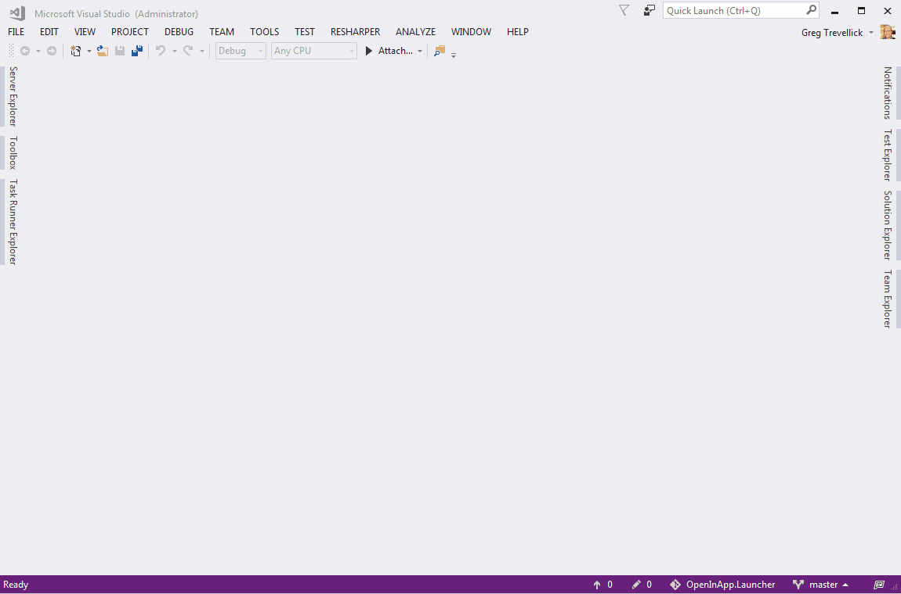

[VersionNumberBadgeURL]: https://vsmarketplacebadge.apphb.com/version/GregTrevellick.OpenInEmacs.svg
[VSMarketplaceUrl]: https://marketplace.visualstudio.com/search?term=trevellick&target=VS&sortBy=Relevance
[CharityWareURL]: https://github.com/GregTrevellick/MiscellaneousArtefacts/wiki/Charity-Ware
[WhyURL]: https://github.com/GregTrevellick/MiscellaneousArtefacts/wiki/Why

# Open In App Launcher

<!--BadgesSTART-->

<!-- Powered by https://github.com/GregTrevellick/ReadMeSynchronizer -->

<!--BadgesEND-->

A [CharityWare][CharityWareURL] repository containing code for use in a series of [Visual Studio][VisualStudioURL] extensions that allow multiple files to be opened simultaneously in third party applications directly from within the [Visual Studio IDE][VisualStudioURL] code editor window and / or Solution Explorer.

The [Visual Studio][VisualStudioURL] extensions are officially available at the [Visual Studio Marketplace][VSMarketplaceUrl].

If you like any of these ***free*** extensions, please give them a [review][VSMarketplaceUrl].

Contributions to this project are welcome by raising an [Issue][GitHubRepoIssuesURL] or submitting a [Pull Request][GitHubRepoPullRequestsURL].

Bugs can be logged [here][GitHubRepoIssuesURL].

See the [change log](CHANGELOG.md) for release history.

Software License is available [here](/LICENSE.txt).

[Why?][WhyURL]

---------------------------------------

 

## Legal

The [owner](https://github.com/GregTrevellick) of this [GitHub repository / software][GitHubRepoURL] is not affiliated, associated, authorized, endorsed by, employed by, sponsored by, or in any way officially connected with any of the third party application entities or any of its subsidiaries or its affiliates.

Nor has [this][GitHubRepoURL] software been authorised, approved, verified or in anyway assessed by any of the third party application entities, or any of its subsidiaries or its affiliates, either as [raw source code][GitHubRepoURL] on [GitHub.com](https://github.com/) or as a [Visual Studio Extension][VSMarketplaceUrl] in the [Visual Studio Marketplace](https://marketplace.visualstudio.com/vs).

All Trademark, intellectual property rights, and other rights belonging to any of the third party application entities  apply.

All logos and links belong to any of the third party application entities and their use here and any associated goodwill inures to any of the third party application entities.

In no event shall any of the third party application entities be liable for any claim, damages or other liability, whether in an action of contract, tort or otherwise, arising from, out of or in connection with the software or the use or dealings in the software.

## Credits

Inspired and adapted from these original code repositories

- [Mads Kristensen](https://github.com/madskristensen) 
  - [Open in Sublime Text](https://github.com/madskristensen/OpenInSublimeText/ "Open in Sublime Text")
  - [Open in Visual Studio Code](https://github.com/madskristensen/OpenInVsCode "Open in Visual Studio Code")
- [Calvin Allen](https://github.com/CalvinAllen) 
  - [Open in NotePad++](https://github.com/CalvinAllen/OpenInNotepadPlusPlus  "Open in NotePad++") 
- [Cem Yabansu](https://github.com/cemyabansu) 
  - [Publish In Crm](https://github.com/cemyabansu/PublishInCrm "Publish In Crm")
- [Allen Conway](http://www.allenconway.net/2015/06/using-opencover-and-reportgenerator-to.html) 

Additional thanks to

- [Visual Studio Extensibility](http://www.visualstudioextensibility.com/)
- [Visual Studio Extensibility code samples](https://github.com/visualstudioextensibility/VSX-Samples)
- [Build 2016 Conference](https://channel9.msdn.com/Events/Build/2016/B886) 
- [Visual Studio Toolbox](https://channel9.msdn.com/Shows/Visual-Studio-Toolbox/Extensions-by-Mads-Kristensen)
- [Screen To Gif](http://www.screentogif.com/) 
- [Paint Dot Net](http://www.getpaint.net/)  
- [Dot Net Curry](https://github.com/dotnetcurry/grunt-gulp-visualstudio/tree/master/Gulp%20files%20for%20VS%202013)   

[][GitHubPagesURL]

[AppVeyorProjectUrl]: https://ci.appveyor.com/project/GregTrevellick/openinapp-launcher
[AppVeyorProjectBuildStatusBadgeSvg]: https://ci.appveyor.com/api/projects/status/0vwmtcboontemltq?svg=true
[GitHubPagesURL]: https://gregtrevellick.github.io/OpenInApp.Launcher/
[GitHubRepoURL]: https://github.com/GregTrevellick/OpenInApp.Launcher
[GitHubRepoIssuesURL]: https://github.com/GregTrevellick/OpenInApp.Launcher/issues
[GitHubRepoPullRequestsURL]: https://github.com/GregTrevellick/OpenInApp.Launcher/pulls
[VisualStudioURL]: https://www.visualstudio.com/
