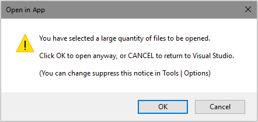

[AppVeyorProjectUrl]: https://ci.appveyor.com/project/GregTrevellick/openinapp-launcher
[AppVeyorProjectBuildStatusBadgeSvg]: https://ci.appveyor.com/api/projects/status/0vwmtcboontemltq?svg=true
[GitHubPagesURL]: https://gregtrevellick.github.io/OpenInApp.Launcher/
[GitHubRepoURL]: https://github.com/GregTrevellick/OpenInApp.Launcher
[GitHubRepoIssuesURL]: https://github.com/GregTrevellick/OpenInApp.Launcher/issues
[GitHubRepoPullRequestsURL]: https://github.com/GregTrevellick/OpenInApp.Launcher/pulls
[ThirdPartyAppHomePage]: https://marketplace.visualstudio.com/search?term=trevellick&target=VS&sortBy=Relevance
[ThirdPartyAppOfficialLogo]: OpenInApp_Generic_175x175.png 
[VisualStudioURL]: https://www.visualstudio.com/
[VSMarketplaceUrl]: https://marketplace.visualstudio.com/search?term=trevellick&target=VS&sortBy=Relevance

# Open In App Launcher

[![Build status][AppVeyorProjectBuildStatusBadgeSvg]][AppVeyorProjectUrl]

A repository containing code for use in a series of Visual Studio extensions that allow a file to be opened in third party applications directly from within Visual Studio.

The [Visual Studio][VisualStudioURL] extensions are officially available at the [Visual Studio Marketplace][VSMarketplaceUrl].

---------------------------------------

Open multiple files simultaneously in a third party application directly from [Visual Studio's][VisualStudioURL] Solution Explorer.

[![][ThirdPartyAppOfficialLogo]][ThirdPartyAppHomePage]

## Features

- Open multiple files simultaneously in the third party application with VS2012, VS2013 and VS2015.

  

- Warning if attempting to open a large quantity of files. The quantity is configurable in Tools > Options.

  

- Warning if attempting to open one or more file types whose extension is not typically associated with the third party application. The list of typical file extensions is configurable in Tools > Options.

  

- Option to supress the warning message if attempting to open a file whose extension is not typically associated with the third party application.

  

## Use Cases

The [Visual Studio IDE][VisualStudioURL] has an outstanding and feature-rich editor for a wide range of file types, even in the free "Community" editions, which can be overridden to open a third-party application.

That said, there may be times when you wish to edit a file in an alternative editor/application without overriding the default [Visual Studio][VisualStudioURL] editor, for example:-

- You only occasionally wish to use a specific alternative editor.
- You have overriden the default [Visual Studio][VisualStudioURL] editor to a particular application, but need easy IDE access to a second particular editor.
- Certain files (e.g. gigantic size files, or files with complex content) may be better suited in an alternative editor.
- Pair programming scenarios where each developer has different preferred editor.
- You are more familiar with a certain editor's features, or simply have a favourite editor.

<!--COPY END FOR VS GALLERY-->

## Legal

The [owner](https://github.com/GregTrevellick) of this [GitHub repository / software][GitHubRepoURL] is not affiliated, associated, authorized, endorsed by, employed by, sponsored by, or in any way officially connected with any of the third party application entities or any of its subsidiaries or its affiliates.

Nor has [this][GitHubRepoURL] software been authorised, approved, verified or in anyway assessed by any of the third party application entities, or any of its subsidiaries or its affiliates, either as [raw source code][GitHubRepoURL] on [GitHub.com](https://github.com/) or as a [Visual Studio Extension][VSMarketplaceUrl] in the [Visual Studio Marketplace](https://marketplace.visualstudio.com/vs).

All Trademark, intellectual property rights, and other rights belonging to any of the third party application entities  apply.

All logos and links belong to any of the third party application entities and their use here and any associated goodwill inures to any of the third party application entities.

In no event shall any of the third party application entities be liable for any claim, damages or other liability, whether in an action of contract, tort or otherwise, arising from, out of or in connection with the software or the use or dealings in the software.

## Credits

Adapted from code originally written by [Mads Kristensen](https://github.com/madskristensen) [here](https://github.com/madskristensen/OpenInSublimeText/ "Open in Sublime Text") and [here](https://github.com/madskristensen/OpenInVsCode "Open in Visual Studio Code").

Also adapted from code originally written by [Calvin Allen](https://github.com/CalvinAllen) [here](https://github.com/CalvinAllen/OpenInNotepadPlusPlus).
 
Thanks also to [Carlos Quintero](http://www.visualstudioextensibility.com/), Visual Studio Extensibility [sample code](https://github.com/visualstudioextensibility/VSX-Samples) and [Cem Yabansu](https://github.com/cemyabansu).

Additional thanks goes to [Build 2016 Conference](https://channel9.msdn.com/Events/Build/2016/B886) and [Visual Studio Toolbox](https://channel9.msdn.com/Shows/Visual-Studio-Toolbox/Extensions-by-Mads-Kristensen).

Thanks also to the third party application entities themselves
- [Altova XMLSpy XML Editor](http://www.altova.com/xml-editor/)
- [GIMP - GNU Image Manipulation Program](https://www.gimp.org/)
- [Markdown Monster](https://markdownmonster.west-wind.com/)
- [Microsoft Visual Studio](https://www.visualstudio.com/vs/)
- [Paint.Net](http://www.getpaint.net/)

## Miscellaneous

Contributions to this project are welcome by raising an [Issue][GitHubRepoIssuesURL] or submitting a [Pull Request][GitHubRepoPullRequestsURL].

See the [change log](CHANGELOG.md) for road map and release history.

Bugs can be logged [here][GitHubRepoIssuesURL].

Software [License](/LICENSE.txt).

[][GitHubPagesURL]

Similar "Open In" VS extensions can be found [here](https://marketplace.visualstudio.com/search?term=trevellick&target=VS&sortBy=Relevance).