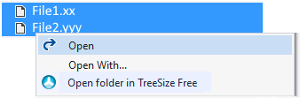

[ThirdPartyAppHomePage]: https://www.jam-software.com/treesize_free/
[VSMarketplaceUrl]: https://marketplace.visualstudio.com/items?itemName=GregTrevellick.OpenInTreeSizeFree
[VSMarketplaceReviewsUrl]: https://marketplace.visualstudio.com/items?itemName=GregTrevellick.OpenInTreeSizeFree#review-details
Open multiple folders simultaneously in [TreeSize Free][ThirdPartyAppHomePage] directly from [Visual Studio's][VisualStudioURL] Code Editor window and / or Solution Explorer.

If you like this ***free*** extension, please give it a [review][VSMarketplaceReviewsUrl].

Similar "Open In" VS extensions can be found [here](https://marketplace.visualstudio.com/search?term=trevellick&target=VS&sortBy=Relevance).

[![][ThirdPartyAppOfficialLogo]][ThirdPartyAppHomePage]

## Features

- Open multiple folders simultaneously in [TreeSize Free][ThirdPartyAppHomePage].

- Within the code editor window
  

- From solution explorer
  

- Warning if attempting to open a large quantity of folders. The quantity is configurable in Tools > Options.

  

## Use Cases

The [Visual Studio IDE][VisualStudioURL] has an outstanding and feature-rich editor for a wide range of file types, even in the free "Community" editions, which can be overridden to open a third-party application.

That said, there may be times when you wish to edit a file in an alternative editor/application without overriding the default [Visual Studio][VisualStudioURL] editor, for example:-

- You only occasionally wish to use a specific alternative editor.

- You have overriden the default [Visual Studio][VisualStudioURL] editor to a particular application, but need easy IDE access to a second particular editor.

- Certain files (e.g. gigantic size files, or files with complex content) may be better suited in an alternative editor.

- Pair programming scenarios where each developer has different preferred editor.

- You are more familiar with a certain editor's features, or simply have a favourite editor.

[ThirdPartyAppOfficialLogo]: ThirdPartyLogo.png
[VisualStudioURL]: https://www.visualstudio.com/
