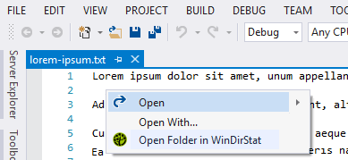
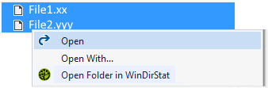

[ThirdPartyAppHomePage]: https://windirstat.net/

Open multiple folders simultaneously in [WinDirStat][ThirdPartyAppHomePage] directly from [Visual Studio's][VisualStudioURL] Code Editor window and / or Solution Explorer.

 - *If you like this ***free*** tool please take a few seconds out to give a star rating below*.

Similar "Open In" VS extensions can be found [here](https://marketplace.visualstudio.com/search?term=trevellick&target=VS&sortBy=Relevance).

[![][ThirdPartyAppOfficialLogo]][ThirdPartyAppHomePage]

## Features

- Open multiple folders simultaneously in [WinDirStat][ThirdPartyAppHomePage].

- Within the code editor window

  

- From solution explorer

  

- Warning if attempting to open a large quantity of folders. The quantity is configurable in Tools > Options.

  

[ThirdPartyAppOfficialLogo]: ThirdPartyLogo.png
[VisualStudioURL]: https://www.visualstudio.com/
